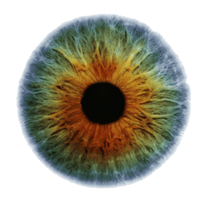
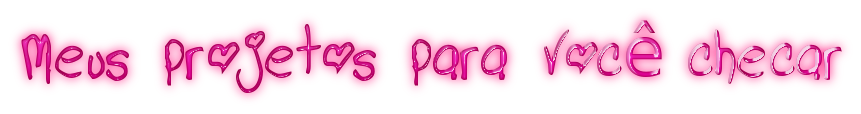

    
  
     
   
  
   
   
  

       ִ⋆.˚✮🐇✮˚.⋆ Eu sou uma etudante de ADS na Fatec de SJC⋆.˚✮🐇✮˚.⋆ 
  
 

<table width="100%" align="center">
<tr>
<td align="center">
  <a href="https://leti-10.github.io">
    <strong>Visite meu Portifólio</strong>
     
     
     
    

      
    </a>
  

</td>

<td align="center">
  <a href="https://youtu.be/fTH71AAxXmM?si=SqkioWTDnWLfReTo">
    <strong>Uma música maneira 🤘</strong>
     
     
    

      
    </a>
  

</td>
</tr>
</table>

&nbsp;&nbsp;&nbsp;&nbsp;  

  
  
  

&nbsp;&nbsp;&nbsp;&nbsp;  

  
  
  

---

  
  

  
  

    
  
    

  

      
  
   
  
   
  
   
   
  
      
 &nbsp;  
   

   

       

       
   

  
     

  
  &nbsp;&nbsp;&nbsp;&nbsp;  
  
  
  
  

